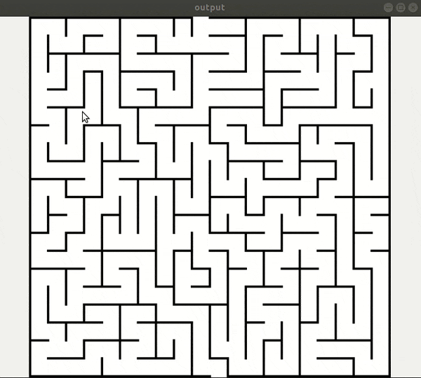

# aasterisk

  

## Dependencies
OpenCV
## Usage
mkdir build
cd build
cmake ..
make
./aasterisk ../data/mc1.png 0
The first parameter is link to input image, second one is the way to calculate heuristic.
0 mean only move four direction(up, down, left, right) from the current pixel.
1 mean can move eight direction.
2 mean can move any direction.
